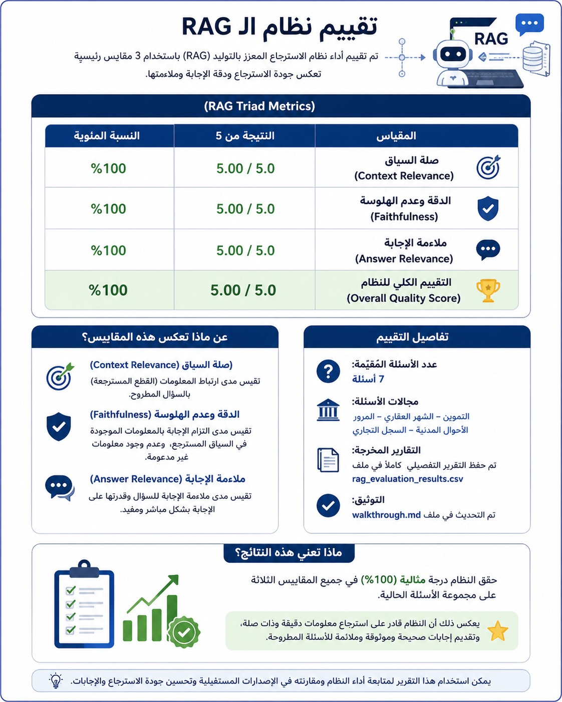

# Digital Egypt Assistant | المساعد الرقمي لخدمات مصر 🇪🇬

[](https://digital-egypt-assistant-k4swnbph4rsfqkvtckrejt.streamlit.app/)

🌐 **Live Demo:** [digital-egypt-assistant.streamlit.app](https://digital-egypt-assistant-k4swnbph4rsfqkvtckrejt.streamlit.app/)

An AI-powered **Arabic-language chatbot** that helps citizens navigate Egypt's digital government services (بوابة مصر الرقمية). Built with **Streamlit**, **LangChain**, **Groq LLMs**, and **RAG (Retrieval-Augmented Generation)** using a ChromaDB vector store and multilingual HuggingFace embeddings.

> اسألني عن أي خدمة رقمية متاحة على بوابة مصر الرقمية

---

## ✨ Features

- **Arabic-first & RTL Layout** — Native Right-to-Left Arabic UI with Egyptian identity styling and custom CSS layout.
- **RAG Architecture** — Retrieves relevant government service information from a local ChromaDB vector store before generating structured responses.
- **Groq LLMs Integration** — Ultra-fast response generation using Groq models (`LLaMA 3.3 70B`, `LLaMA 3.1 8B`, `GPT-OSS 120B`).
- **Structured Service Cards** — Automatically extracts and formats service details (description, requirements, steps, documents, support) into clean HTML cards.
- **Session-aware Memory** — Conversation history is maintained across turns using `StreamlitChatMessageHistory`.
- **Conversation Summarization** — One-click sidebar button condenses the chat history into a short Arabic summary.
- **Quick-access Service Chips** — One-click buttons for popular services (vehicle fines, social insurance, insurance numbers, etc.).
- **Streaming Responses** — Real-time streaming answers chunk-by-chunk for a smooth user experience.

---

## 📊 RAG Model Evaluation / تقييم نموذج الـ RAG



Evaluation results using RAG Triad Metrics:
- **Context Relevance (صلة السياق):** `5.00 / 5.0` (100%)
- **Faithfulness (الدقة وعدم الهلوسة):** `5.00 / 5.0` (100%)
- **Answer Relevance (ملائمة الإجابة):** `5.00 / 5.0` (100%)
- **Overall Quality Score (التقييم الكلي للنظام):** `5.00 / 5.0` (100%)

Run evaluations anytime using:
```bash
python evaluate_rag.py
```

---

## 🛠️ Tech Stack

| Component | Technology |
|---|---|
| Frontend / UI | [Streamlit](https://streamlit.io/) |
| LLM Provider | [Groq](https://groq.com/) (`langchain-groq`) |
| Supported Models | LLaMA 3.3 70B · LLaMA 3.1 8B · GPT-OSS 120B |
| LLM Framework | [LangChain](https://www.langchain.com/) |
| Vector Store | [ChromaDB](https://www.trychroma.com/) |
| Embeddings | `intfloat/multilingual-e5-large` (HuggingFace) |
| Memory | `StreamlitChatMessageHistory` |

---

## 📁 Project Structure

```
Digital-Egypt-Assistant/
├── app.py                          # Streamlit main entry point & page setup
├── config.py                       # AppConfig & VectorStoreConfig (Pydantic settings)
├── ui.py                           # Egyptian theme styling, RTL fixes & custom HTML cards
├── core/
│   ├── llm_factory.py              # Groq LLM factory & Secrets / Env synchronization
│   ├── normalizer.py               # Response normalizer & ServiceResponse extraction
│   ├── prompts.py                  # System prompts & chat templates
│   └── rag_chain.py                # Retrieval & history-aware chain assembly
├── bootstrap/
│   ├── llm_provider.py             # Cached LLM instance manager
│   └── vectorstore_provider.py     # Cached HuggingFace embeddings & Chroma vector store
├── .env.example                    # Environment variable template
├── requirements.txt                # Python dependencies
├── egypt_digital.pkl               # Pickled service dataset
└── infloat/                        # ChromaDB vector store directory
```

---

## 🚀 Getting Started

### Prerequisites

- Python 3.9+
- A free **Groq API Key** from [console.groq.com](https://console.groq.com/keys)

### Installation

1. **Clone the repository:**
   ```bash
   git clone https://github.com/Abo0wael/Digital-Egypt-Assistant.git
   cd Digital-Egypt-Assistant
   ```

2. **Create and activate a virtual environment (optional):**
   ```bash
   python -m venv venv
   source venv/bin/activate   # Linux / Mac
   venv\Scripts\activate      # Windows
   ```

3. **Install dependencies:**
   ```bash
   pip install -r requirements.txt
   ```

4. **Set up Environment Variables:**
   Copy `.env.example` to `.env` and add your Groq API key:
   ```env
   GROQ_API_KEY=gsk_your_groq_api_key_here
   ```

5. **Run the App:**
   ```bash
   streamlit run app.py
   ```

   The app will open in your browser at `http://localhost:8501`.

---

## ⚙️ Deployment on Streamlit Cloud

1. Push your code to your GitHub repository.
2. Go to [share.streamlit.io](https://share.streamlit.io/) and create a new app pointing to `app.py`.
3. Under **Advanced Settings -> Secrets**, add your environment variables in TOML format:
   ```toml
   GROQ_API_KEY = "gsk_your_groq_api_key_here"
   ```
4. Click **Deploy**!

---

## 📜 License

MIT License — free to use, modify, and deploy.
